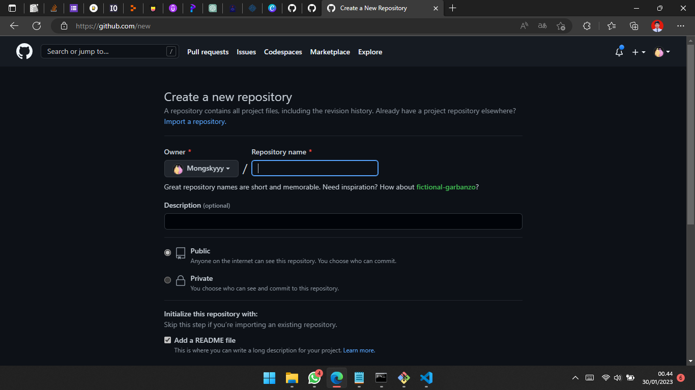
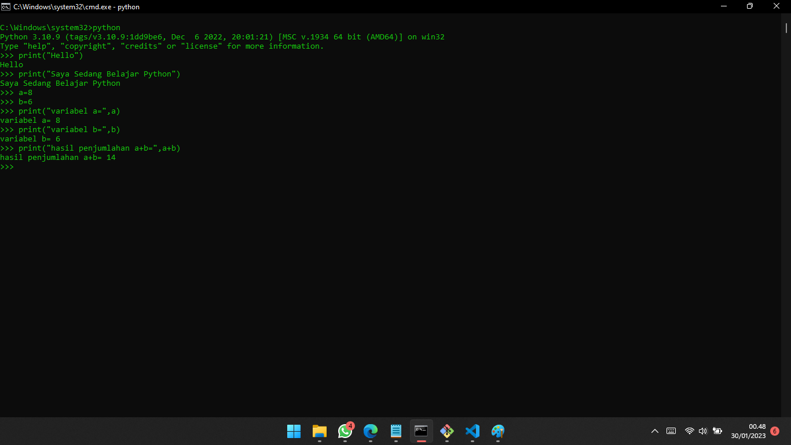
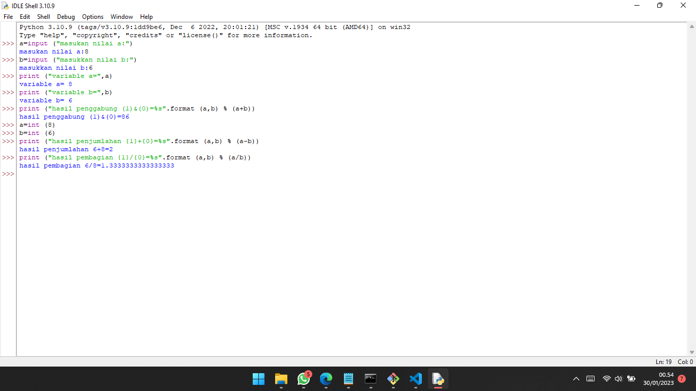

# lab2py

Tugas pertemuan ke 5 Bahasa Pemrograman

Nama : Ramadhan Ardi Iman Prakoso

NIM : 312210722

Kelas : TI.22.C.9

Prodi : Teknik Informatika

## Membuat Repository

## Menjalankan Python Console Menjumlahkan 2 buah bilangan menggunakan variabel a dan b

# Menjalankan idle Membuat file baru dengan nama latihan3.py

# SELESAI